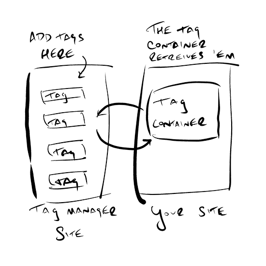
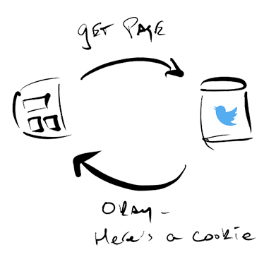
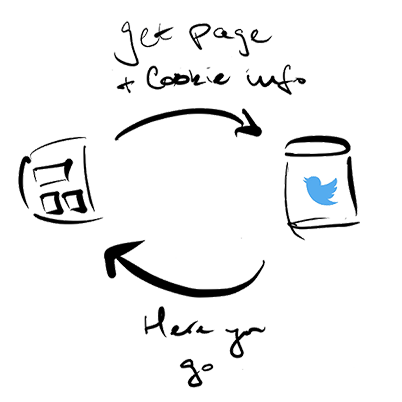
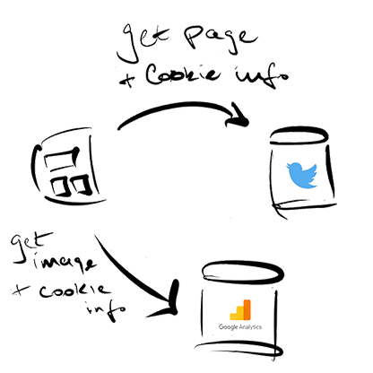

Google Tag Manager makes it easy to place snippets of code, called *tags*, on a website or app without having to directly access the code of the website. Instead of asking an engineer to place different tags over and over, the idea is to instead add a special tag container to your site. Every time someone visits your page, the container will check the Tag Manager website for any tags you put there. If it finds any, it'll load them on your site.

Tags are often, not not exclusively, used to inform external tools such as Google Analytics about user behavior on the site. You put the Google Analytics tag onto the Tag Manager website, when your page loads the tag container on your site will retrieve the tag and you'll send data to Google Analytics.     

Tag manager is flexible - it doesn't just grab every tag and immediately run them when a page loads. Instead, tags are always associated with a _triggering event_. What you are saying is "When *triggering event* happens, tell *tag* about it."

To understand how this works, we need to briefly talk about cookies and pixels.

## Cookies
A "cookie" is a small text file that your browser stores on your device. When you browse to a website, the server responds by sending both the site and any cookies it would like your browser to save.

Your browser will save the cookie and associated it with the site. Any time you visit that site again, your browser will send along the associated cookies.

Cookies are especially useful for staying logged into websites. Let's say you log into Twitter. The Twitter server will generate a long string of text, called a session ID, which your browser will save as a cookie. When you visit Twitter your browser will send along that cookie with its session ID and Twitter will know who you are without needing you a log in.

Cookies also help with tracking, even on sites that don't require a log in. By storing a random session ID in a cookie, you can track where a user goes in your site because the same ID will appear with every incoming request. You won't know who the person is, but you'll know where they went and you can start to map trends -- "People who read this blog post also tend to read this other post."   

## Tracking pixels
Often you'll want to inform third parties, such as Google Analytics, about user behavior on your site. To do this you must somehow get your user's browser to make requests to the third party server so that it can set and track a session ID. Engineers invented a clever way to do this using image requests.  

To show an image, a web site includes a URL that tells the browser where to find the image. By adding a tiny transparent image (a *pixel*) stored on the third party site, you cause the browser to exchange information with that site.

For example, a site might include an image stored on the Google Analytics server. When the browser visits the site, it makes a request to Google Analytics for the image. Google responds with the image and sets a cookie. Now every time the user visits a page with a Google Analytics pixel, the browser sends cookie information and the user can be tracked.

Displaying the image isn't the point, it's only a mechanism for exchanging information with a third party server.

## What does this have to do with Google Tag Manager?
Tags are code that need to be placed on a site and associated with an event. If you want to collect data through Google Analytics, and also want to send site data to Facebook and Twitter to track ad effectiveness, you need to an engineer to add the pixel code for each tracker to every page.

Tag manager makes this much easier. Instead of digging into the site code every time you place a pixel, you instead add the Tag Manager code once. You then add tags and associated triggers to the Tag Manager website. Common tags for Google analytics include:

* When the page loads
* When someone downloads a report
* When someone scrolls more than 50% through a page
* When someone watches more than 50% of a video
* When someone submits a form

Etc.

When someone visits your site, the Tag Manager code will check back to its website and grab any tags you've placed there.    
