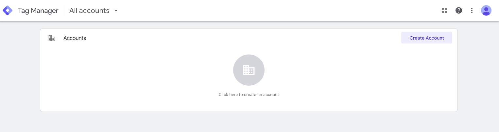

Google Tag Manager makes it easy to place snippets of code, called **tags**, on a website or app without having to directly access the code of the website. Instead of asking an engineer to place different tags over and over, the idea is to instead add a special tag container to your site. Every time someone visits your page, the container will check the Tag Manager website for any tags you put there. If it finds any, it'll load them on your site.

Tags are often, not not exclusively, used to inform external tools such as Google Analytics about user behavior on the site. You put the Google Analytics tag onto the Tag Manager website, when your page loads the tag container on your site will retrieve the tag and you'll send data to Google Analytics.     

Tag manager is flexible - it doesn't just grab every tag and immediately run them when a page loads. Instead, tags are always associated with a **triggering event**. What you are saying is "When **triggering event** happens, tell **tag** about it."

To understand how this works, we need to briefly talk about cookies and pixels.

## Cookies
A "cookie" is a small text file that your browser gets from a website. When you first browse to a website, the server responds by sending both the site and any cookies it would like your browser to save.

Your browser will save the cookie and associated it with the site. Any time you visit that site again, your browser will send along the associated cookie. (Note the browser doesn't send every cookie to a website. It only returns those specific cookies that it received from the website.)

Cookies are especially useful for staying logged into websites. Let's say you log into Twitter. Your browses goes to the Twitter site and you log in. The Twitter server will generate a long string of text, called a session ID, which your browser will save as a cookie. From then on, every time you interact with Twitter your browser will send along the cookie with its session ID and Twitter will know who you are without needing you a log in. Without the cookie, you would have to log in every time you clicked anything on the site.

Cookies also help with tracking, even on sites that don't require a log in. By storing a random session ID in a cookie, you can track where a user goes in your site because the same ID will appear with every incoming request. You won't know who the person is, but you'll know where they went and you can start to map trends -- "People who read this blog post also tend to read this other post."   

## Tracking pixels
Analytics tools such as Google Analytics use session IDs to build reports about how people interact with your site. For this to work you must somehow get your user's browser to interact with the Google Analytics server (and/or other third party servers) so that it can set a session ID. Engineers invented a clever way to do this using image requests.  

Every image on a site includes a URL that tells the browser where it can find the image. By referencing an image stored on a third party site, you cause the browser to make a request to that site to retrieve the image. That request enables a session ID to be set. The image itself is tiny and transparent (a **pixel**), invisible to the user.

To recap: you site include an image stored on the Google Analytics server. To display the image, a visitor's browser makes a request to Google Analytics for the image. Google responds with the tiny image and sets a session ID in a cookie. Now every time the user visits a page with a Google Analytics pixel, the browser sends the session ID back to Google Analytics and the user can be tracked.

## What does this have to do with Google Tag Manager?
Tags are code that need to be placed on a site and associated with a triggering event. Without Tag Manager you'd need an engineer to place individual tags on every page for Google Analytics, and another tag to track Facebook conversions, and another tag to track Twitter conversions.

Tag manager makes this much easier. Instead of digging into the site code every time you want to add a tag, you instead add the Tag Manager code once. You then add tags and associated triggers to the Tag Manager website. Common triggers for Google analytics include:

* When the page loads
* When someone downloads a report
* When someone scrolls more than 50% through a page
* When someone watches more than 50% of a video
* When someone submits a form

Etc.

When someone visits your site, the Tag Manager code will check back to its website and grab any tags you've placed there.    

## Setting up a Tag Manager account
To get started with Tag Manager, go to the Tag Manager website at [tagmanager.google.com](https://tagmanager.google.com/) and click "Create Account"

Fill out the simple form.



You'll need to read and agree to the terms and conditions. Once you do that you'll be presented with the Tag Manager code.



This is the only code you'll need to install on your site to support tags. Once it's installed, any tags you place in the Tag Manager website will be used on your site.
