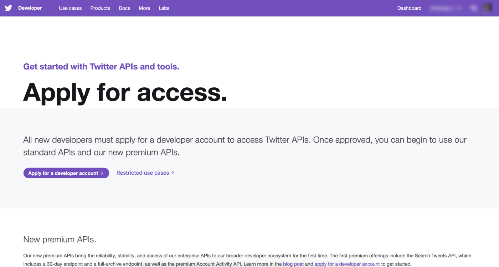
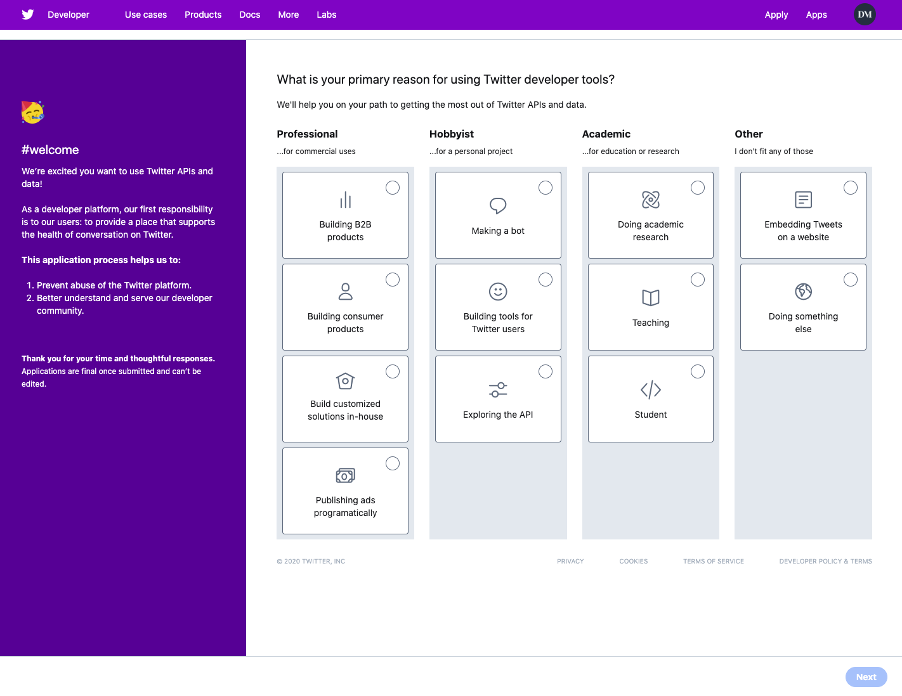
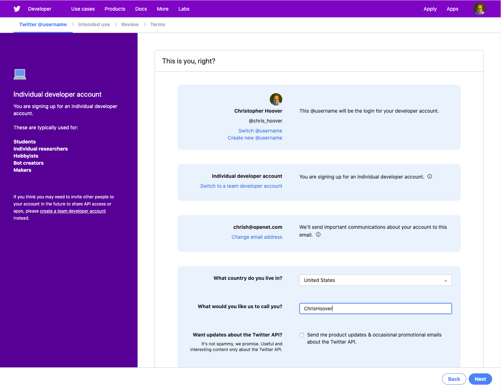
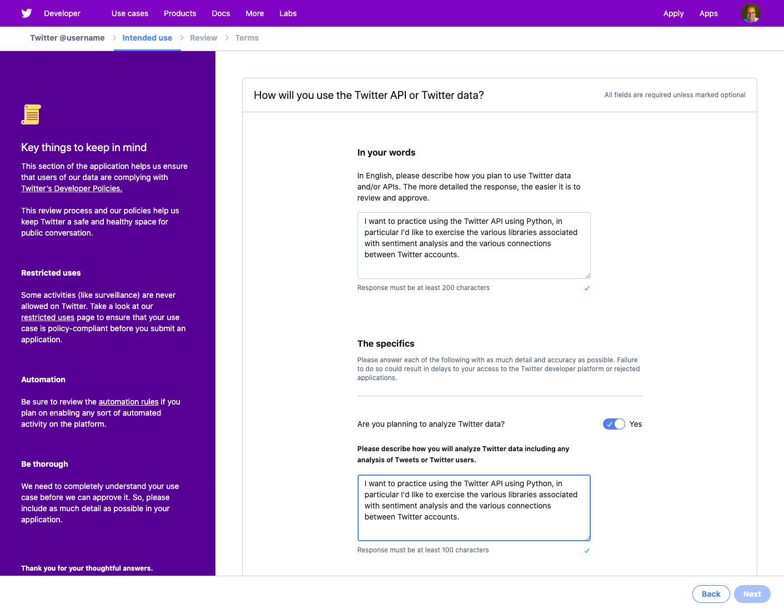
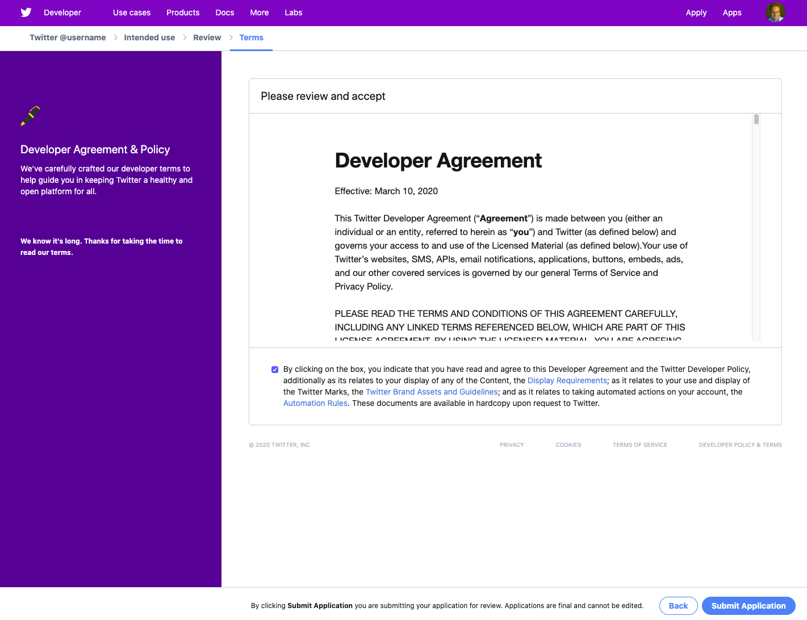
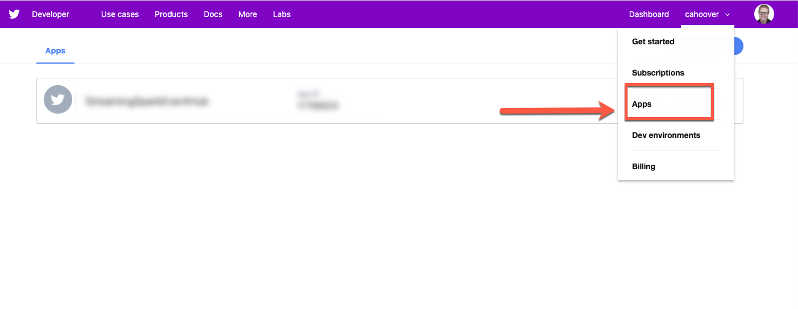
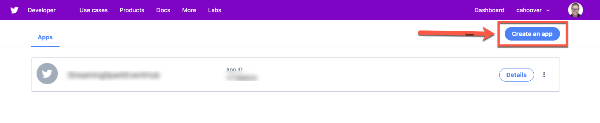
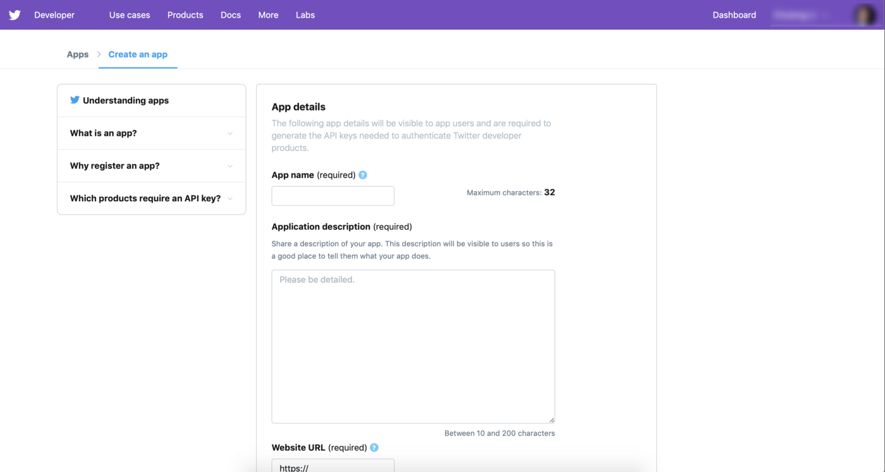
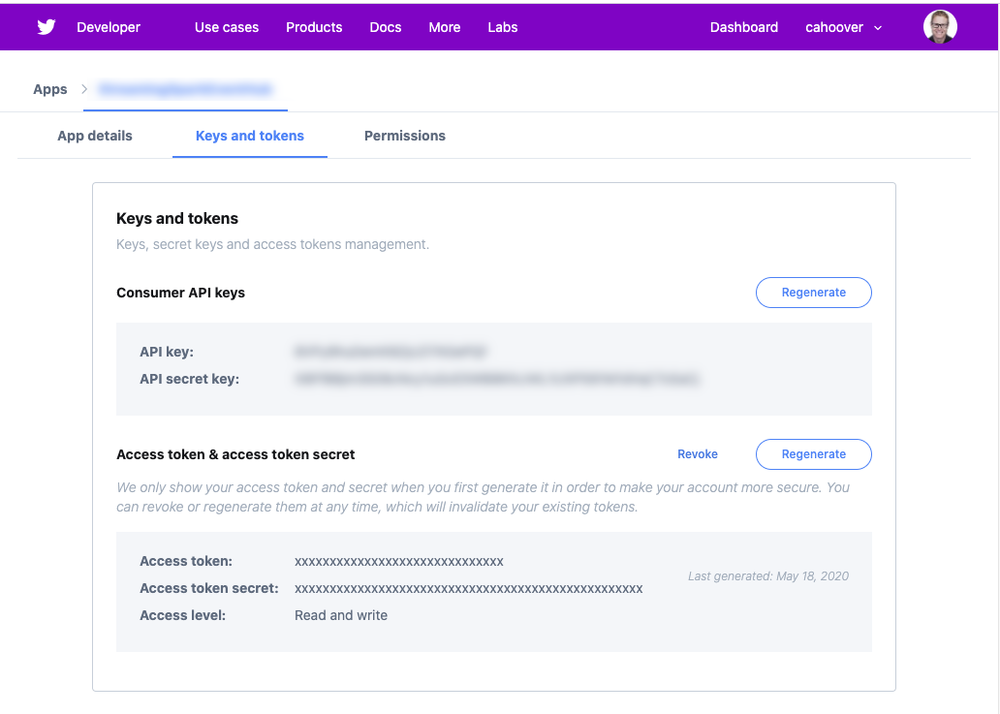

To get started with the Twitter API, you first need to sign up for a developer account at [developer.twitter.com](https://developer.twitter.com/en/apply/user.html)



You'll need to complete your Twitter profile if it's not already done (many people need to enter a telephone number - be sure and enter one that can receive an SMS verification code, you'll need it to continue with the application).

## Select a primary reason for using the API
Here you'll tell Twitter your high level use of the API.



## Confirm your identity
Make sure you're in the right account.



## Describe your use of the API
Twitter will ask you to describe the use of the API. There's no reason not to be as transparent and complete as you can. For example, I'm going to practice using the various Python APIs, so that's what I said.



## Agree to the rules

Read the developer agreement, click the "agree" box and submit your application. Normally you'll get your developer account approved in a day or two. If Twitter has any follow up questions they'll be in touch.



## Create an app

Twitter requires two sets of authentication tokens. One is your developer token, which you receive when you sign up for API access. The second is an "app" token, which is associated with the code you are writing. In this step we'll create an app token.

Once you have your developer account approved, log into [developer.twitter.com](https://developer.twitter.com) and click on your username in the upper right. Select "Apps"



On the apps page, click "create an app"



You'll be asked to fill out a brief form



Once you create your app, you can access both your developer tokens and the app tokens by going to the apps page and clicking on an app.

 

## Get the tokens ready for use

When we write code that uses the Twitter API, we'll use these tokens to authenticate. It's similar to a username and password.

One way to do this is to add the tokens directly to code. But that's a hassle because you wind up hunting around for them and copying and pasting. Better to store your tokens in a file and reference them.

To do this we'll create a snippet of Python called credentials.py that is imported into the code we write. That way you can create all sorts of API calls without having to worry about tokens.

Open your terminal and navigate to the folder you're going to use to contain the code you write to practices with the Twitter API. Nano is a common terminal text editor, and we'll use it to create your credentials file.

```
nano credentials.py
```

When the editor opens, type the following

```
#twitter credentials
TWIT_API_KEY = 'XXXXXXXXXXXXXXXXXXXXXXXXX'
TWIT_API_SECRET_KEY = 'XXXXXXXXXXXXXXXXXXXXXXXXXXXXXX'
TWIT_ACCESS_TOKEN = 'XXXXXXXXXXXXXXXXXXXXXXXXXXXXXXXXX'
TWIT_ACCESS_TOKEN_SECRET = 'XXXXXXXXXXXXXXXXXXXXXXXXXXX'

```

Make sure you replace XXX with the actual tokens!

Press control-X, save your file, and exit.

## Create a client

To use the Twitter API, we need to install a Python library that understands how to use it. Official Twitter libraries are available only for the premium and enterprise API, so we'll be using a community developed library. There are many, and you can find a list of them on the [Twitter developer site.](https://developer.twitter.com/en/docs/developer-utilities/twitter-libraries)

We'll be using the [Tweepy library](https://github.com/tweepy/tweepy). It's been around for years, has many contributors, and provides good support for all API features.

### Enter a virtual environment
If you haven't already created a Python virtual environment, go over to [our article on the topic](/resources/virtual-environments-in-anaconda). Enter your virtual environment.

```
conda activate [environment]
```
Where [environment] is the name of your virtual environment.

### Install the Tweepy and json libraries
Then install Tweepy

```
conda install -c conda-forge tweepy
```

### Create a Twitter client

The Twitter client holds the authentication tokens and uses the Tweepy API to access Twitter and retrieve data. Instead of rewriting code that does this over and over, we'll write it once and then call the client in subsequent code.

Use the nano text editor to create twitter_client.py and enter it.

```
nano twitter_client.py
```

Once in the editor, type this code

```
import credentials #This retrieves your tokens from credentials.py
from tweepy import API #The API functions from Tweepy
from tweepy import OAuthHandler #The authentication function from Tweepy

def set_twitter_auth():
    try:
        api_key = credentials.TWIT_API_KEY
        api_secret = credentials.TWIT_API_SECRET_KEY
        access_token = credentials.TWIT_ACCESS_TOKEN
        access_secret = credentials.TWIT_ACCESS_TOKEN_SECRET
    except KeyError:
        sys.stderr.write("Couldn't find credentials. Have you created a credentials.py file with the right token names?\n")
        sys.exit(1)
    auth = OAuthHandler(api_key, api_secret)
    auth.set_access_token(access_token, access_secret)
    return auth

def get_twitter_client(): #We set up the client
    auth = set_twitter_auth() #Get the auth tokens
    client = API(auth) #Define the client with the auth tokens
    return client #Now we have a client object to use in our code.
```

## Test it out

Whew! We now have our auth tokens and have define a client that uses them to access the API. Let's test out our client by grabbing some of our own most recent tweets.

Use the nano text editor to create twitter_10tweets.py and enter it.

```
nano twitter_10tweets.py
```

Once in the editor, type this code

```
from tweepy import Cursor
from twitter_client import get_twitter_client

if __name__ == '__main__':
    client = get_twitter_client()

    for status in Cursor(client.home_timeline).items(10):
        print(status.text)
```

Now press control-x to save and exit the editor.

Now, making sure that credentials.py, twitter_client.py and twitter_10tweets.py are all in the same folder, test out your code by typing

```
python twitter_10tweets.py
```
If all is well, the terminal should return your last ten tweets.
