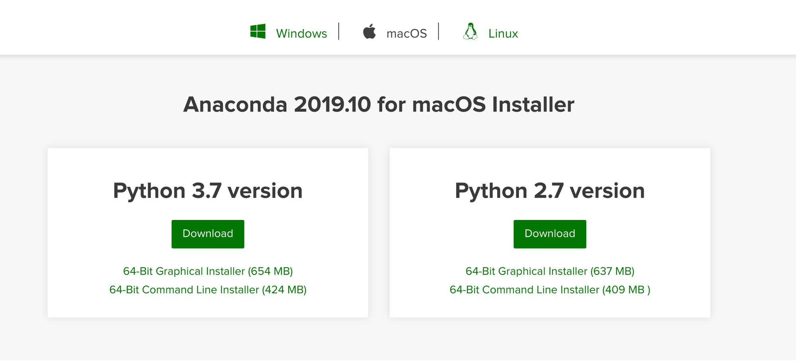
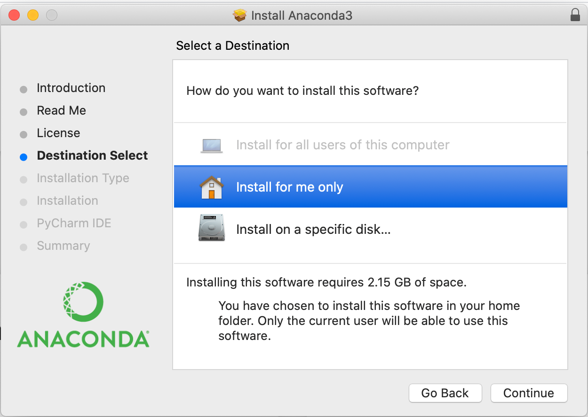
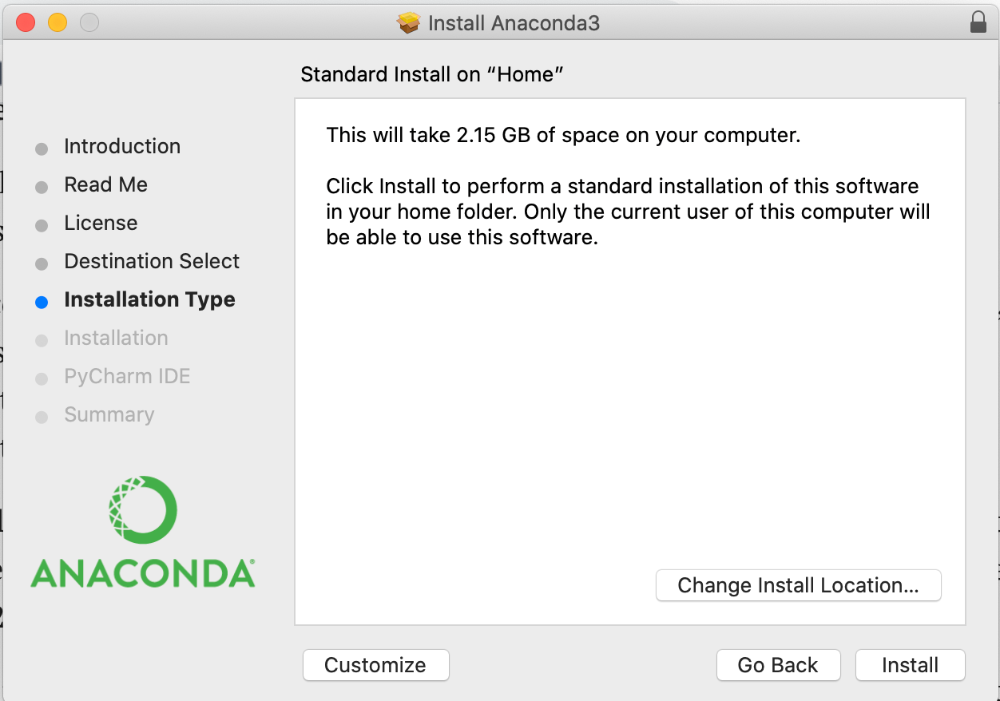
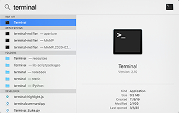
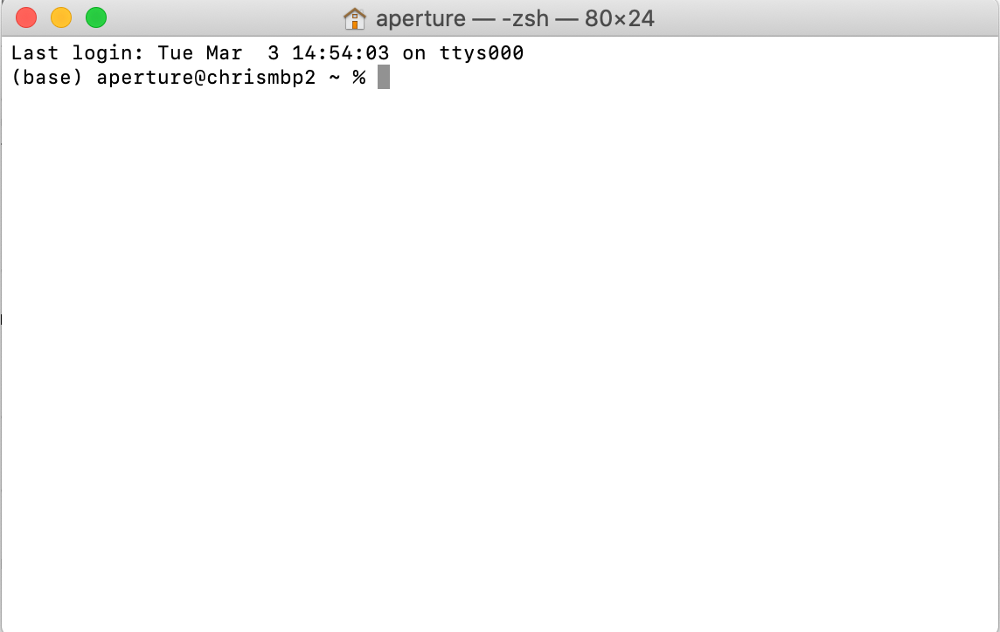

This post describes how to install Python and R on your Windows machine via a special distribution called Anaconda. If you are using Windows, there's a separate post that describes installation on your machine.
Because both Python and R are open source languages, people are free to update and extend them in any way they like. Our goal today is to
Install a trusted distribution of Python and R that's tested and supported.
Create a safe environment that we can use for Python experiments without any danger of breaking anything along the way .

## Installing Anaconda
Anaconda is a free and open source distribution of Python and R that makes it easy to install these languages on your computer. Because it's built especially for data science, Anaconda also comes conveniently bundled with many packages and extensions that we'll use for data exploration and visualization.

To install Anaconda on your machine, first go to the [Anaconda download page](https://www.anaconda.com/distribution/) in your browser. Somewhere on the page should be your download options, like this.

You should choose the Python 3.7 (or above) 64 bit version. It's the default.




When the installer has downloaded, double click on it to install Anaconda. You'll see the standard OSX installation dialogue. If you like, read through the introduction, Read Me and License. When prompted for the destination, most users will choose "Install for me only" (it's the default).

Click "Continue"



The next screen asks for installation type. If you choose to change your location, you'll just be returned to the previous screen. Not sure why it works this way.



The installer will do its thing, and eventually finish. When it's done, click command (⌘) - shift to bring up the OSX search bar, and type "Terminal."



Select the top hit - Terminal. This, shockingly, will open your terminal.



If you've used the terminal before, you'll see a new addition. The word (base) in parentheses has been added to the terminal prompt. We'll go over that in a sec. In the meantime, you can make sure all is well by typing the following into the terminal. Note the "V" is uppercase!

```
$ conda -V
conda 4.7.12
```

See that the prompt begins with the word (base)? That indicates that you are in the base virtual environment (the default) installed by Anaconda.

What's a virtual environment? Let's get to that next.

## Creating a virtual environment
Individual Python projects often have libraries and files specific to it - that aren't used by other projects. There's always a risk that libraries can conflict with one another. To keep multiple Python projects organized – and to ensure they don't conflict – we'll create a virtual environment for each of our projects.

A virtual environment is a named, working copy of Python that is isolated from the rest of your machine. Each environment has separate files, directories, and paths so that you can work with specific versions of libraries or Python itself without affecting other projects.

### Create an environment

The easiest way to create a virtual environment is using the conda create command:

```
conda create --name myname
```

You'd replace "myname" with the name of your virtual environment.

### Activate an environment
To enter in your virtual environment and start using it, type

```
conda activate myname
```

Of course, you will enter the actual name of your environment instead of "myname." You'll now see that (base) has been replaced with the name of your environment to indicate that it is now active.

### Deactivate your environment

You can deactivate your environment and return to base with:
```
conda deactivate
```


## Helpful commands
<br />
### Specific version of Python
You can create a virtual environment with a specific version of python this way:

```
conda create -n myenv python=3.6
```
<br />
### Clone an environment

```
conda create --name myclone --clone myenv
```

<br />
### List environments
```
conda env list
```

<br />
### List packages in an active environment
```
conda list
```
<br />
To **list the packages** in an inactive environment
```
conda list -n myenv
```
<br />
### Listing specifications
Helpful to see the details of what's installed within

```
conda list --explicit
```
