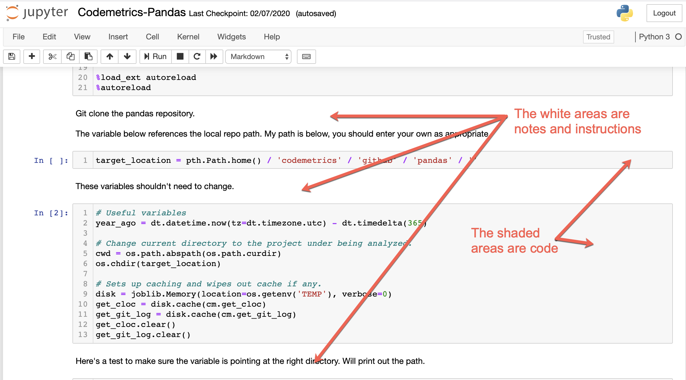
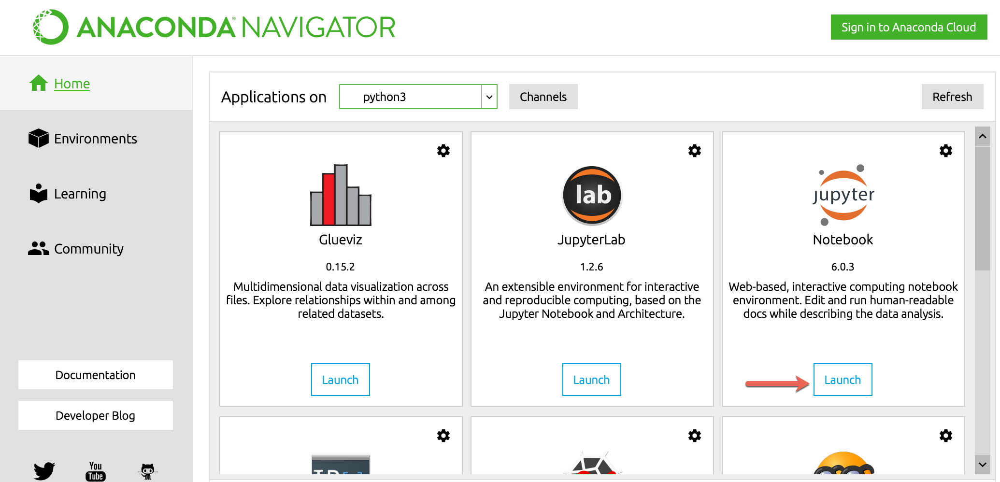
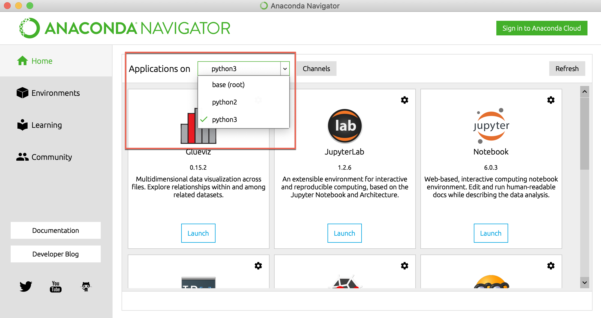

## Why bother
Jupyter notebook lets you enter and run snippets of code with added notes and instructions. Take a look at the following screenshot (ignore the actual code right now):



The notebook has **two alternating sections**:

- The white sections contain notes. You can write anything you wish.
- The grey section contains code. They code can be run independently of any other code on the page.

### Running code in the notebook
When you run the code sections, Jupyter notebook displays the output of the code (which could be an error message). In this way you can work on your Python code in logical blocks, understanding the goal of each area and fixing any bugs that come along.

## Installing Jupyter Notebook
If you installed Python using Anaconda, Jupyter is installed automatically. You can launch it by starting Anaconda Navigator and clicking the launch button under Jupyter.
<br><br>

<br><br>
Remember to choose the virtual environment you wish to work in before running Jupyter notebook by selecting from the dropdown at the top (see screenshot below). Selecting an environment means that you are using Jupyter notebook in that environment.

Not sure what a virtual environment is? You should learn about them – read more here.
<br><br>



You can also launch Jupyter Notebook from the terminal by typing:

```
% jupyter notebook
```

Jupyter Notebook works inside your browser.  If you start it from Anaconda Navigator, the browser will open to the appropriate URL automatically. If you start it from the Terminal, it'll tell you the URL, something like this:
```
The Jupyter Notebook is running at:
[I 16:25:14.396 NotebookApp] http://localhost:8888/
```

## Installing Jupyter
If for some reason Jupyter isn't installed in your Anaconda environment, you can install it directly through Anaconda navigator or you can use the terminal.

```
conda install -c anaconda jupyter
```
