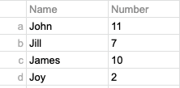
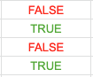
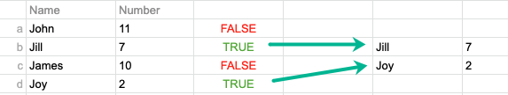

## Introduction
This page is a quick reference for exploring data using Boolean indexing in Pandas. Remember that a boolean operation returns only True or False, and can only be performed against a series.

Using booleans in data is usually a two-step process: the first step is to evaluate the series and identify which cell is true and which is false relative to the given boolean. The second step is to filter the series based on  the boolean result.

For example, consider the following simple dataframe, which samples four people associated with the number of times the person has seen Star Wars:



Let's establish a boolean to evaluate which people have see the film fewer than 10 times?

```{python}
evaluation = df['number'] < 10
```
What this does is evaluate every entry in the column 'number', compare it with the boolean, and place the result in the series "evaluation." Now we have evaluation, a series that evaluates the truthiness of the boolean



The second step is to use this true/false evaluation as a filter, creating a new series populated by values that are true.

```{python}
deprived_persons = df['evaluation']
```


Now we have a new series called deprived_persons that contains two rows.


## Import and export some data

Read in some data. See full documentation [here](https://pandas.pydata.org/pandas-docs/stable/reference/api/pandas.read_csv.html).
```{python}
data = pd.read_csv('data.csv')

# Helpful parameters
header=None
names= #array of column names, must explicitly pass header=0 to use
usecols= #returns a subset of the columns

```

## Get meta information about your data

It's useful at the beginning of an analysis to get a handle on what you are looking at

```{python}
# Return the type of data you're working on
data_type = type(data)

# Return the data types in a dataframe
col_types = df.dtypes

# Return the dimensions of the dataframe
df.shape

# Return meta information about the dataframe
df.info()

# Return meta information about a numerical series
series.describe()

# Return meta information about a series in a dataframe
df['column'].describe()
```

## Exploring meta data across rows and columns
The next bit can be tricky. The df calculations require specifying which axis to use for the calculations. Indicating 0 or index' means that Pandas will calculate **down the row axis** -- the result will be for each column. Indicating 1 or 'column' means that Pandas will calculate **across the column axis** -- the result will be for each row.

It's easier (for me at least) to think of axis 0 as &darr; and axis 1 as &rarr;

```{python}
# Return max in a series or dataframe (df requires axis)

# Remember, axis 0 calculates down v and axis 1 calculates across >;

series.max() df.max(axis=0) #(default) Calculate columns down the row axis
series.min() df.min(axis=1) #column #Calculate rows across the column axis
series.mean() df.mean(axis='index') #(default row)
series.mode() df.mode(axis='column') #column
series.sum() df.sum(axis=)

# For example, to find median value for ```revenues``` and ```profits``` columns:

medians = df[['revenues', 'profits']].median(axis=0)

```

Look at the data itself

```{python}
# Return the first n entries
df.head(n)

# Return the last n entries
df.tail(n)
```
This one is useful to see where data is missing. If you have 50,000 rows and 22,000 are non-null, you've got some missing data...

```{python}
# Get the number of non-null values in a column
count = df["column"].value_counts
```

## Select rows and columns

```{python}
# Select a single column
column = df["column"]

# Select multiple columns
columns = df[['column1', 'column2']]

# Select a slice of columns
columns = df.loc[:,'column1':'column4']

# Select a single row
row = df.loc['row']

# Select multiple rows
rows = df.loc[['row1', 'row2']]

# Select a slice of rows
rows = df.loc[['row1':'row4']]

```
## Exploring the scope within a dataframe

```{python}

```

```{python}

```

```{python}

```
